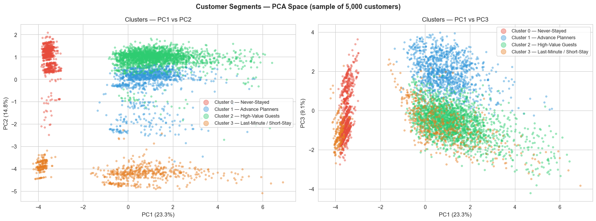
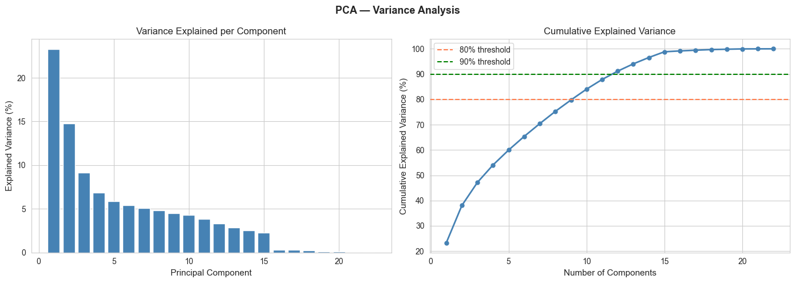
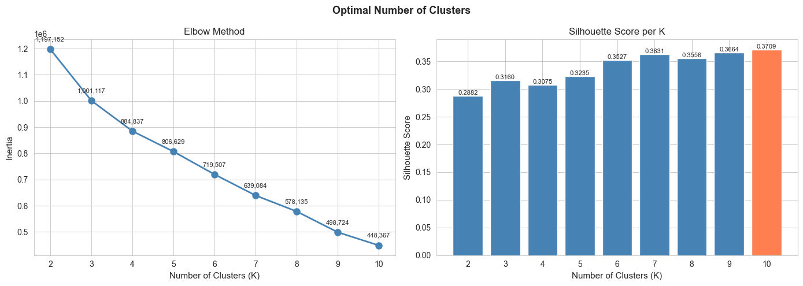
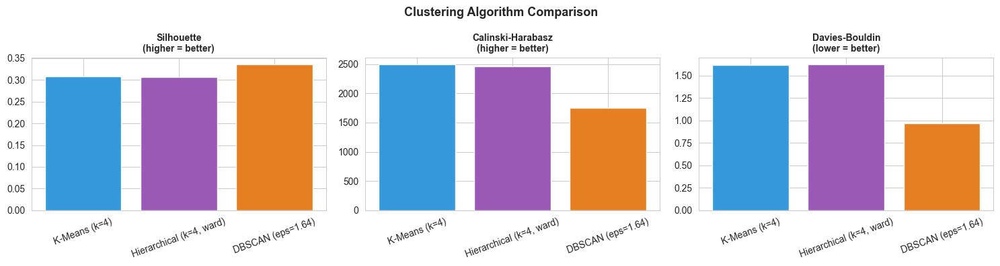
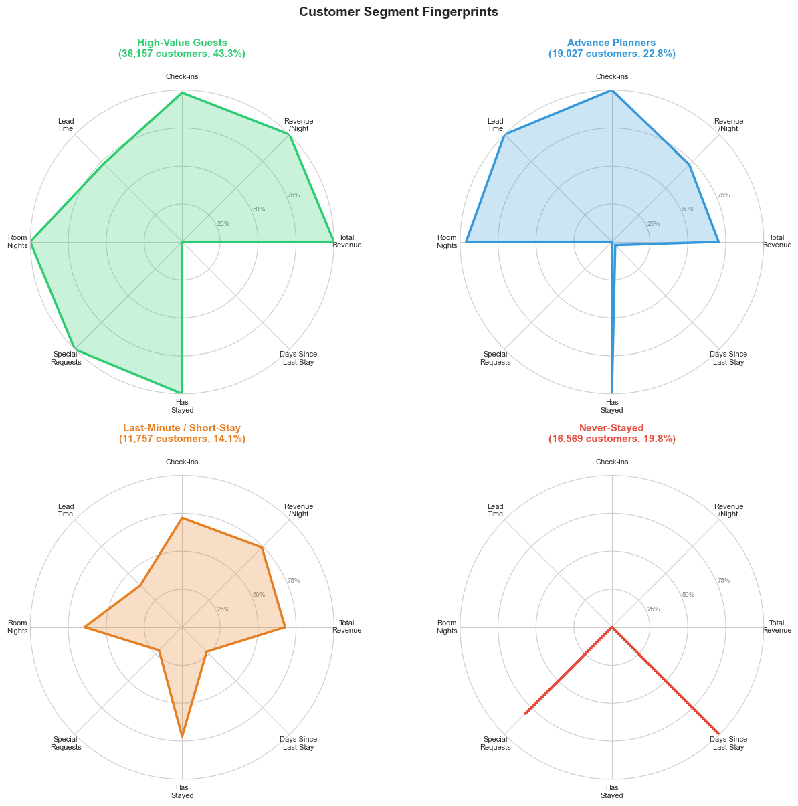
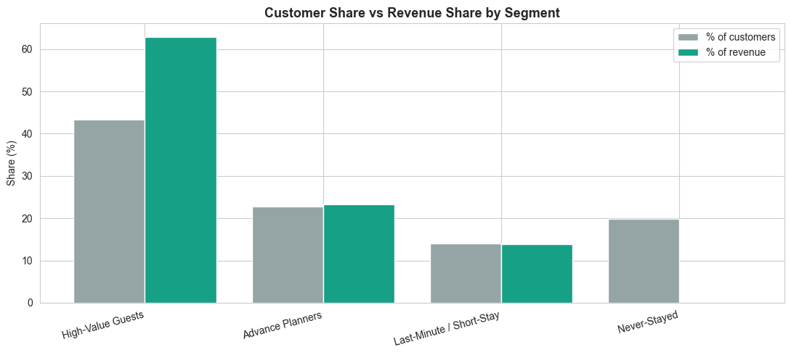

# Hotel Guest Segmentation Engine

Data-driven customer segmentation for a hotel chain. It replaces a single "which channel did they book through" rule with four behavior-based segments the marketing team can actually act on.

## The business problem

A four-star hotel in Lisbon has been segmenting its 83,510 customers one way for years: by booking channel: travel agency, OTA, direct website. That tells the marketing team almost nothing about who the customer actually is. A corporate traveler and a leisure tourist who both happened to book through the same OTA get treated identically, even though they behave completely differently and are worth completely different amounts.

This project replaces that single-variable segmentation with one built from the customer's actual behavior: how far ahead they book, how much they spend, how often they stay, and what they request. The output is four segments, each with a measured profile and a specific marketing action. A cluster is a statistical grouping; a segment is something the marketing team can act on.

## The result

Four segments, found with K-Means (K=4, silhouette 0.31) on 10 principal components (84% of variance retained from the original feature set):

| Segment | Customers | Share | Revenue share | Avg. spend/customer |
|---|---|---|---|---|
| **High-Value Guests** | 36,157 | 43.3% | **62.9%** | €518 |
| Advance Planners | 19,027 | 22.8% | 23.3% | €364 |
| Last-Minute / Short-Stay | 11,757 | 14.1% | 13.9% | €351 |
| **Never-Stayed** | 16,569 | 19.8% | 0.0% | €0 |



High-Value Guests are 43% of the customer base and generate 63% of all revenue, so they are the clear priority for retention. But the more actionable finding is the segment that generates nothing at all.

## The finding that matters most: Never-Stayed is a process bug, not noise

A standard clustering project would report four segments and move on. The fourth segment here, 19.8% of the entire customer base and zero revenue, is not simply "low-value customers to deprioritize." Digging into what actually separates it from the paying segments: **lead time**. Guests who stayed booked roughly 94 days in advance. Never-Stayed customers show 0 days: the record was created on the arrival date, or with no date at all. That's a registration placeholder created by a travel agent partner, not a real booking.

The result is a structural ~24% non-conversion rate in the Travel Agent channel, thousands of lost stays a year from an audience that looks, on paper, identical to the paying one. This is a CRM process fix, since the segmentation only revealed the pattern: flag Travel Agent registrations with lead time under ~7 days as unconfirmed until a deposit lands, and require a non-refundable deposit from high-volume partners. This is the highest-leverage recommendation in the whole project, and it would have been invisible without segmenting on behavior instead of channel.

## Approach

**1. Business understanding.** Defined clear success criteria before modeling: 3–7 interpretable clusters, silhouette above 0.2, no cluster under 1% of the base, and every segment tied to a marketing action, since statistically distinct groups alone don't help a marketing team.

**2. Data cleaning.** 83,590 raw records, 31 variables from the hotel's PMS/CRM. Removed 80 exact duplicates, fixed sentinel values (`-1` in recency fields meant "never stayed," not a real value, so it was replaced with a flag plus a placed-at-the-end value), capped outliers at the 99th percentile, imputed missing age by nationality median. Full traceable issue log in the notebook, sections 2.4–2.10.

**3. Feature engineering.** Built `TotalRevenue`, `AvgRevenuePerNight`, `RevenuePerBooking`, `CancellationRate`, and a domestic/international flag. Checked multicollinearity with VIF and correlation, dropping features that were subsumed by aggregates.

**4. Dimensionality reduction.** PCA to 10 components, retaining 84% of variance: enough signal, few enough dimensions for K-Means to behave well on a dataset this size.



**5. Choosing K.** Tested K=2 through K=10 with the elbow method and silhouette score. The elbow has no sharp bend and silhouette technically peaks near K=10, but a 10-segment solution isn't something a marketing team can act on. **K=4 was chosen for interpretability**, not because it scored highest. That is a deliberate trade-off, stated explicitly rather than hidden behind the metric that happened to look best.



**6. Model comparison.** K-Means, Hierarchical (Ward), and DBSCAN, all fit on the same 10,000-customer sample so the internal validation metrics are comparable:

| Model | Clusters | Silhouette | Calinski-Harabasz | Davies-Bouldin |
|---|---|---|---|---|
| **K-Means (k=4)** | 4 | 0.308 | **2490** | **1.617** |
| Hierarchical (k=4) | 4 | 0.306 | 2459 | 1.622 |
| DBSCAN | ~18 | 0.335 | 1752 | 0.966 |

DBSCAN scores best on two metrics, but only by producing ~18 micro-clusters plus a noise class, which isn't usable for a marketing team. K-Means was chosen: matches the brief's 3–7 segment range, scales to the full 83,510-row dataset (Hierarchical is O(n²) and can't), and its metrics are competitive with Hierarchical anyway.



**7. Segment profiling and naming.** K-Means assigns arbitrary integer labels, so cluster "0" isn't necessarily the same segment on every run. Segment names are derived programmatically from each cluster's own behavioral profile (spend, lead time, stay pattern), not hardcoded, so a name can never silently attach to the wrong group if the model is re-run.





## Marketing recommendations by segment

- **High-Value Guests: retain and deepen.** Build a direct relationship (loyalty tier, named contact for top spenders), reduce dependency on OTA commission for this group.
- **Advance Planners: grow the base.** Reliable, plannable demand; the most internally dispersed segment, and the first candidate for a finer sub-segmentation.
- **Last-Minute / Short-Stay: reactivate cheaply, measure hard.** Revenue-neutral to their headcount; worth targeted flash offers, not full-price campaigns.
- **Never-Stayed: fix the process, don't buy the phantom.** This is not a marketing target. A CRM lead-time filter on Travel Agent bookings is the actual fix.

## Limitations

- The High-Value segment (43% of the base) is large; a finer value-tier split inside it could sharpen targeting further.
- Cancellation and no-show behavior was too sparse (~0.14% of customers) to include as a modeling dimension.
- Nationality was frequency-encoded, which keeps geography as a signal but loses country-level detail.
- This is a snapshot. Customers move between segments over time, so re-scoring periodically (recommended: quarterly) is necessary to keep the segmentation current.

## Repository structure

```
├── notebooks/
│   └── hotel-guest-segmentation-engine.ipynb   # full analysis, EDA to segment recommendations
├── reports/
│   └── figures/                                 # key visualizations
├── data/
│   └── README.md                                # data dictionary and source
├── requirements.txt
└── LICENSE
```

## Tech stack

Python, pandas, scikit-learn (K-Means, Agglomerative Clustering, DBSCAN, PCA), matplotlib, seaborn.

## Data source

[A hotel's customers dataset](https://www.kaggle.com/datasets/nantonio/a-hotels-customers-dataset), originally published as a peer-reviewed data article: Antonio, N., de Almeida, A., & Nunes, L. (2020). *A hotel's customers personal, behavioral, demographic, and geographic dataset from Lisbon, Portugal (2015–2018)*. Data in Brief, 33, 106583. [https://doi.org/10.1016/j.dib.2020.106583](https://doi.org/10.1016/j.dib.2020.106583). See `data/README.md` for the full data dictionary.
